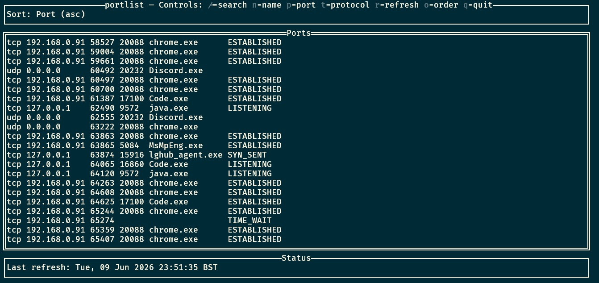
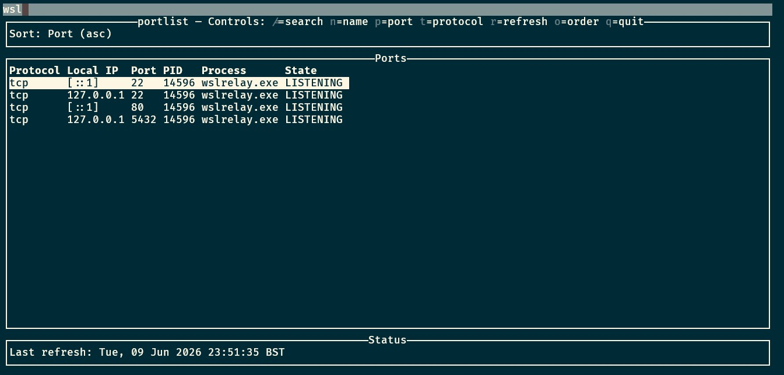

# portlist



A TUI tool to list active network ports and their owning processes on Windows. Built with Go and [tview](https://github.com/rivo/tview).

## Controls

| Key | Action |
|-----|--------|
| `/` | Open search (filter by port or process name) |
| `Esc` | Close search / clear filter |
| `n` | Sort by process name |
| `p` | Sort by port number |
| `t` | Sort by protocol |
| `o` | Toggle ascending/descending order |
| `r` | Refresh (re-run `netstat`) |
| `q` | Quit |

## Usage

```
portlist.exe
```

Press `/` to start typing a search query — results filter in real-time as you type. Press `Esc` to clear the search and return to the full list.


